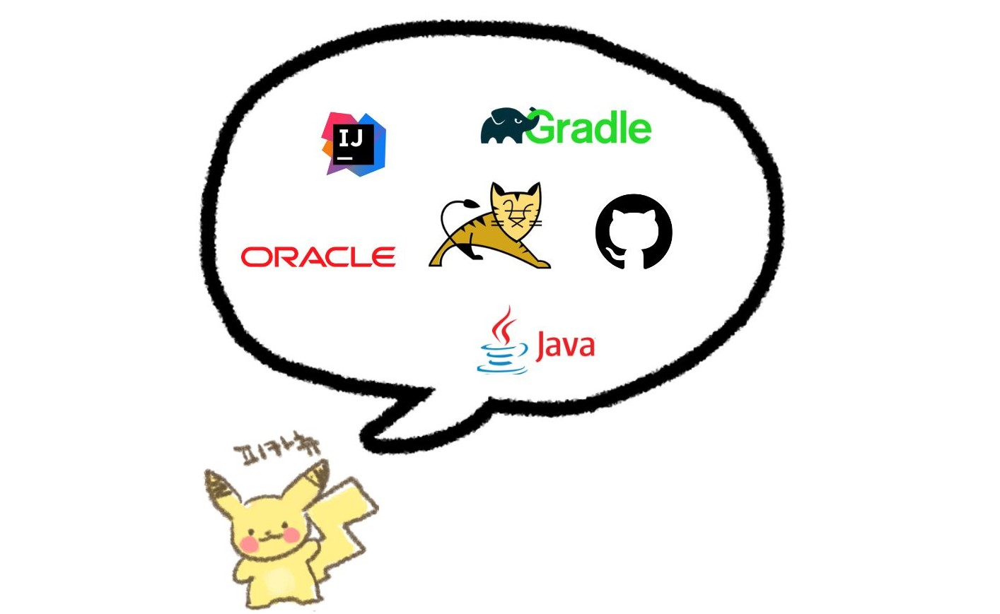

# 😎 포켓몬 도감 프로젝트 ✌
# 1. 프로젝트 소개
### 🔹 개요
- 프로젝트명 : 포켓몬 도감 프로젝트


### 🔹 기획 배경 및 기대 효과


# 2. 개발 환경

- Intelli J
- Gradle
- java
- GitHub
- Oracle
- Apache Tomcat
  <BR>

# 3. UserFlow 작성
<BR>

# 4. 기능 명세서
## 🔹 관리자 페이지 🔹
### 📌 회원 관리
- 가입된 회원 목록 조회
- 회원 강퇴 기능
- 관리자 정보 조회
- 관리자 정보 수정
- 비밀번호 변경 시 비밀번호 일치 확인

### 📌 게시판 관리
- 게시판 폼 등록하기
- 게시판 폼 수정하기
- 게시판 폼
  - 게시판 이름, 게시판 사용 여부, 카테고리 분류, 권한 설정
  - 페이지 관련 기능 (한 페이지에 게시글 갯수)
- 게시글 목록 (해당 게시판으로 이동 - 등록,수정,삭제 가능)

<BR>

## 🔹 사용자(회원) 페이지 🔹
## 메인
- 메뉴 버튼 클릭 시 각 메뉴로 이동
- 스토어 버튼 통해 스토어로 이동
- 푸터 SNS 버튼 통해 각 SNS로 이동
- 관리자 로그인 시 상단에 사이트 관리 버튼 생성

##  🔒 회원
### 로그인
- 필수항목 입력 확인
- 로그인한 이메일 기억하기
- 회원이 아닌 경우 하단 버튼을 통해 회원가입 페이지로 이동
- 입력한 이메일을 통해 가입된 회원인지 검증
- 아이디와 비밀번호 일치 여부 확인
- 로그인 성공 시 메인페이지로 이동

### 회원가입
- 필수항목 입력 확인
- 이메일 형식 확인
- 이메일 중복여부 확인
- 비밀번호 8자리 이상 입력 확인
- 비밀번호는 암호화(hashing) 과정 거쳐 DB에 저장
- 회원가입 성공 시 로그인 페이지로 이동
### 마이페이지
- 현재 로그인한 회원 정보 조회
- 회원 정보 수정
- 비밀번호 변경 시 비밀번호 일치 확인
- 회원 탈퇴
- 회원 탈퇴 시 비밀번호 확인 후 탈퇴
- 즐겨찾기한 포켓몬
  <BR>

## 게시판
- 게시판 별 목록 조회
- 게시판 상단 카테고리 선택시 해당 카테고리의 게시글만 조회
  - 예) 공지사항의 공지 | 이벤트 | 업데이트 ->업데이트 선택시 업데이트 게시글만 조회

### 게시글 조회
- 제목, 작성자, 내용, 제목+내용 으로 조회

### 📋게시글
- 게시글 작성, 수정, 삭제 기능
- 게시글 보기 기능
- 파일 업로드 기능
- 파일 다운로드 기능
- 권한
    - 관리자/회원/비회원 접근 권한 부여
    - 관리자) 모든 게시판, 게시글 접근 가능
    - 회원, 비회원) 공지사항 제외한 게시판 접근 가능, 본인 게시글만 수정, 삭제 가능

<BR>

## 🚩포켓몬 도감
- 페이지 관련 기능
    - 1페이지에 포켓몬 25마리 설정
    - 페이지 이동 기능
- 포켓몬 이미지 클릭 시 각 포켓몬 개별 페이지로 이동
- 하트 이모티콘 클릭시 마이포켓몬 페이지에 즐겨찾기 등록
### 포켓몬 조회하기
포켓몬 이름 검색시 검색어가 포함된 포켓몬 검색
-하단 페이지 이동번호로 다음 포켓몬 조회
### 개별 포켓몬 페이지
- 이전,다음 포켓몬 클릭시 도감기준 다음 이전,다음번호 포켓몬 개별 페이지로 이동
- 목록으로 돌아가기 클릭시 도감 메인페이지로 이동
### 오늘의 포켓몬 뽑기 게임
- (마이페이지) 내가 즐겨찾기한 포켓몬
  - 즐겨찾기 된 포켓몬 이미지 출력
  - 즐겨찾기 된 포켓몬 선택 삭제 및 전체 삭제
- (마이페이지) 랜덤 포켓몬 뽑기 클릭시 랜덤뽑기 페이지로 이동
  - 포켓몬 볼 클릭시 랜덤으로 새로운 포켓몬 출력
  - 저장시 즐겨찾기에 포켓몬 추가


<BR>

# 5. ERD 작성 (엔티티 관계도)

<BR>

# 6. 테이블 다이어그램
## MEMBER
```

```
## BOARD
```

```
## BOARD_DATA
```

```
## COMMENTS
```

```
<BR>

# 7. 역할 분담

<BR>

# 8. 일정표
