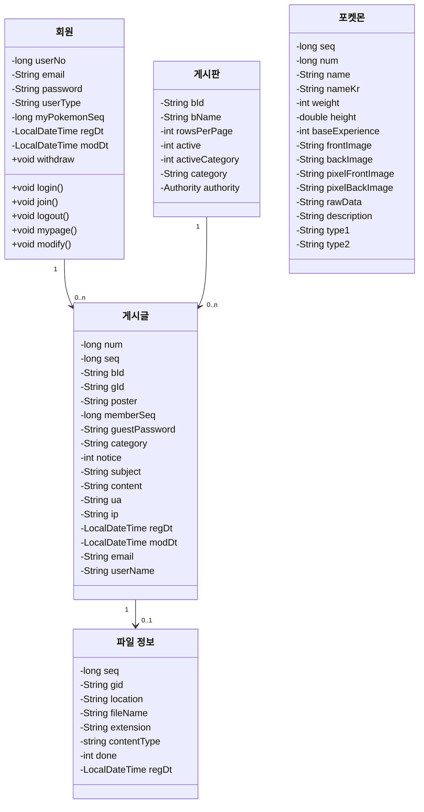

# 😎 포켓몬 도감 프로젝트 ✌
# 1. 프로젝트 소개
### 🔹 개요
- 프로젝트명 : 포켓몬 도감 프로젝트(????)
### 🔹 기획 배경 및 기대 효과
<BR>

# 2. 개발 환경
- Intelli J
- Gradle
- java
- GitHub
- Oracle
- Apache Tomcat  


<br>


<BR>

# 3. UserFlow 작성
<BR>

# 4. 기능 명세서
## 🔹 관리자 페이지 🔹
### 📌 회원 관리
- 회원 조회

### 📌 게시판 관리
- 게시판 등록, 수정 기능
- 게시판 사용 여부, 카테고리 분류, 권한 설정
- 페이지 관련 기능
  - 한 페이지에 게시글 갯수
    
    
### 📌 게시글 관리
- 게시글 관리 폼 (...ING ...)
- 게시글 등록, 수정, 삭제 기능

<BR>


## 🔹 사용자(회원) 페이지 🔹
##  🔒 회원
### 로그인
- 비밀번호는 암호화(hashing) 과정 거쳐 DB에 저장
### 회원가입
- EMAIL : 이메일 형식으로 작성되었는지 확인, 중복 여부 확인
- PASSWORD : 8자리 이상의 비밀번호인지 확인
### 마이페이지
- 회원 정보 조회 및 수정
- 회원 탈퇴하기
- 작성글 조회하기 (...ING...)
- 나의 포켓몬 보기 (...ING...)

<BR>

## 📋게시글
- 권한
    - ADMIN/USER/GUEST 권한별 게시글 접근 권한 부여
    - ADMIN - 모든 게시판, 게시글 접근 가능
    - USER, GUEST - 공지사항 제외한 게시판 접근 가능, 본인 게시글만 수정, 삭제 가능 
- 게시판 카테고리 별 리스트
  - 각 카테고리 클릭 -> 카테고리별 게시글 리스트만 출력
### 게시글 검색
- 제목, 작성자, 내용, 제목+내용 으로 조회

### 파일 업로드 & 다운로드
- ...ING...

<BR>

## 🚩포켓몬 도감
- 페이지 관련 기능
    - 1페이지에 포켓몬 25마리 설정
    - 페이지 이동 기능
- 포켓몬 클릭시 포켓몬 이미지, 속성 출력
### 포켓몬 조회하기
- 포켓몬 이름 조회 기능
### 오늘의 포켓몬 뽑기 게임
- 몬스터볼 클릭 시 랜덤으로 포켓몬 출력


<BR>

# 5. ERD 작성 (엔티티 관계도)

<BR>

# 6. 테이블
## MEMBER
```


```
## BOARD
```

```
## BOARD_DATA
```

```
## COMMENTS
```

```
<BR>

# 7. 역할 분담

<BR>

# 8. 일정표
