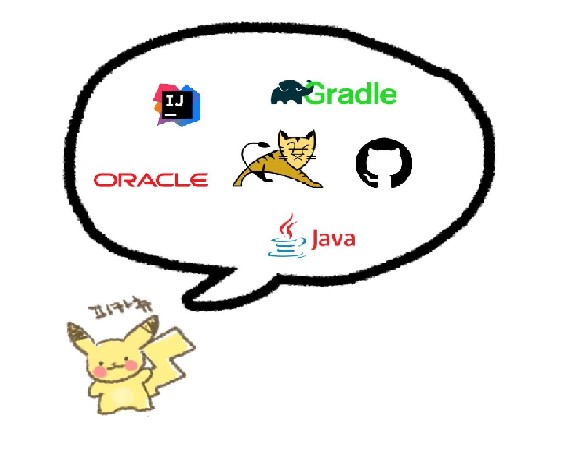
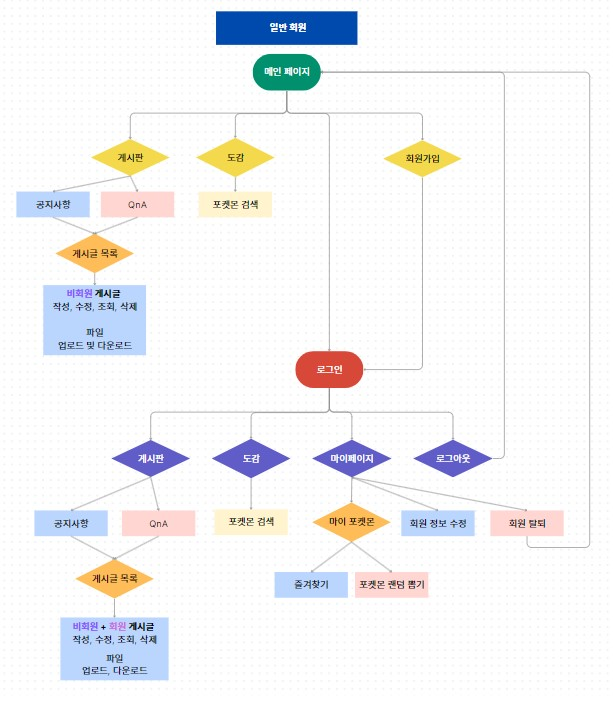
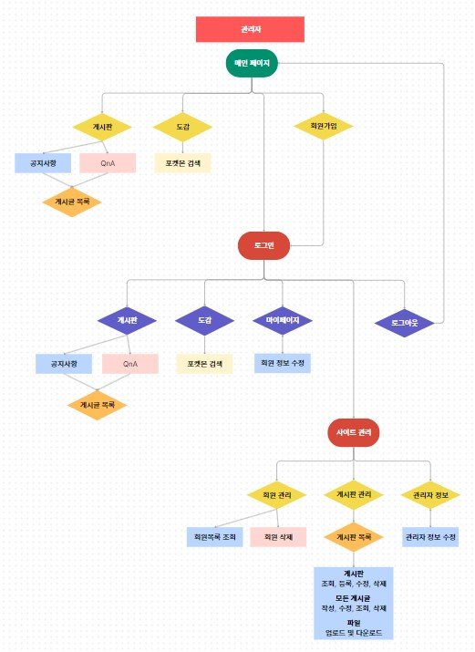
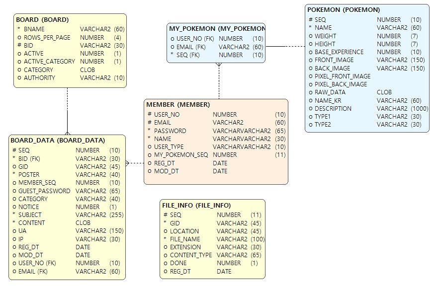
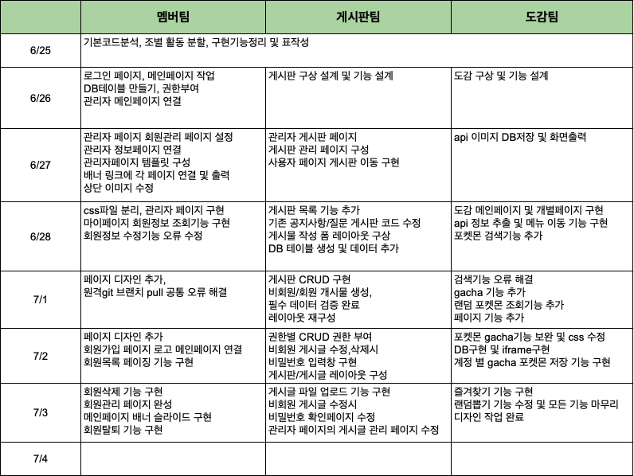
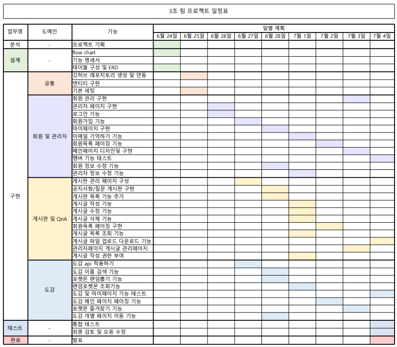

# 😎 포켓몬 도감 프로젝트 ✌
# 1. 프로젝트 소개
### 🔹 개요
- 프로젝트명 : 포켓몬 도감 프로젝트
  
아직도 포켓몬이 존재한다고 믿고있는 예비 포켓몬 트레이너를 위한 도감입니다.
차세대 한지우가 되는 것을 꿈꾸거나 포켓몬의 세계에 대해 호기심이 있는 경우,  
이 가이드는 모험을 시작하는 데 필요한 모든 정보를 제공할 것입니다. 
각 포켓몬의 고유한 능력, 특성에 대해 알아보세요.

### 🔹 기획 배경 및 기대 효과

캠핑이 유행하는 요즘,  
숲 속에는 때로는 귀엽고 때로는 사악하고 무서운 우리의 친구이자 적이자 동료인 포켓몬이 살아가고 있습니다.
이 도감은 언제 어디서 어떻게 왜 누구랑 무엇을 하며 나타날지 모르는 상황을 대비해 각 속성과 특성을 미리 파악하여 대처 할 수 있도록 만든 도감입니다.  
사건 사고가 많은 요즘 같은 날 오늘도 안전하고 무사하며 친구와 가족들을 보호할 수 있는, 안전 또 안전한 하루를 보내길 바랍니다.

# 2. 개발 환경

- Intelli J
- Gradle
- java
- GitHub
- Oracle
- Apache Tomcat  

 

 

# 3. UserFlow 작성

 

# 4. 기능 명세서
## 🔹 관리자 페이지 🔹
### 📌 회원 관리
- 가입된 회원 목록 조회
- 회원 강퇴 기능
- 관리자 정보 조회
- 관리자 정보 수정
- 비밀번호 변경 시 비밀번호 일치 확인

### 📌 게시판 관리
- 게시판 폼 등록하기
- 게시판 폼 수정하기
- 게시판 폼
  - 게시판 이름, 게시판 사용 여부, 카테고리 분류, 권한 설정
  - 페이지 관련 기능 (한 페이지에 게시글 갯수)
- 게시글 목록 (해당 게시판으로 이동 - 등록,수정,삭제 가능)

 

## 🔹 사용자(회원) 페이지 🔹
## 메인
- 메뉴 버튼 클릭 시 각 메뉴로 이동
- 스토어 버튼 통해 스토어로 이동
- 푸터 SNS 버튼 통해 각 SNS로 이동
- 관리자 로그인 시 상단에 사이트 관리 버튼 생성

##  🔒 회원
### 로그인
- 필수항목 입력 확인
- 로그인한 이메일 기억하기
- 회원이 아닌 경우 하단 버튼을 통해 회원가입 페이지로 이동
- 입력한 이메일을 통해 가입된 회원인지 검증
- 아이디와 비밀번호 일치 여부 확인
- 로그인 성공 시 메인페이지로 이동

### 회원가입
- 필수항목 입력 확인
- 이메일 형식 확인
- 이메일 중복여부 확인
- 비밀번호 8자리 이상 입력 확인
- 비밀번호는 암호화(hashing) 과정 거쳐 DB에 저장
- 회원가입 성공 시 로그인 페이지로 이동
### 마이페이지
- 현재 로그인한 회원 정보 조회
- 회원 정보 수정
- 비밀번호 변경 시 비밀번호 일치 확인
- 회원 탈퇴
- 회원 탈퇴 시 비밀번호 확인 후 탈퇴
- 즐겨찾기한 포켓몬
   

## 📋게시판
- 게시판 별 목록 조회
- 게시판 상단 카테고리 선택시 해당 카테고리의 게시글만 조회
  - 예) 공지사항의 공지 | 이벤트 | 업데이트 ->업데이트 선택시 업데이트 게시글만 조회

### 게시글 조회
- 제목, 작성자, 내용, 제목+내용 으로 조회

### 게시글
- 게시글 작성, 수정, 삭제 기능
- 게시글 보기 기능
- 파일 업로드 기능
- 파일 다운로드 기능
- 권한
    - 관리자/회원/비회원 접근 권한 부여
    - 관리자) 모든 게시판, 게시글 접근 가능
    - 회원, 비회원) 공지사항 제외한 게시판 접근 가능, 본인 게시글만 수정, 삭제 가능

 

## 🚩포켓몬 도감
- 페이지 관련 기능
    - 1페이지에 포켓몬 25마리 설정
    - 페이지 이동 기능
- 포켓몬 이미지 클릭 시 각 포켓몬 개별 페이지로 이동
- 하트 이모티콘 클릭시 마이포켓몬 페이지에 즐겨찾기 등록
### 포켓몬 조회하기
포켓몬 이름 검색시 검색어가 포함된 포켓몬 검색
-하단 페이지 이동번호로 다음 포켓몬 조회
### 개별 포켓몬 페이지
- 이전,다음 포켓몬 클릭시 도감기준 다음 이전,다음번호 포켓몬 개별 페이지로 이동
- 목록으로 돌아가기 클릭시 도감 메인페이지로 이동
### 오늘의 포켓몬 뽑기 게임
- (마이페이지) 내가 즐겨찾기한 포켓몬
  - 즐겨찾기 된 포켓몬 이미지 출력
  - 즐겨찾기 된 포켓몬 선택 삭제 및 전체 삭제
- (마이페이지) 랜덤 포켓몬 뽑기 클릭시 랜덤뽑기 페이지로 이동
  - 포켓몬 볼 클릭시 랜덤으로 새로운 포켓몬 출력
  - 저장시 즐겨찾기에 포켓몬 추가

 

# 5. ERD 작성 (엔티티 관계도)

 

# 6. 테이블 다이어그램
# MEMBER
| 키  | 논리     | 물리        | 도메인           | 타입    | UNIQUE | NULL허용 | 기본값     | 코멘트   | 
|:--:|--------|-----------|---------------|-------|--------|--------|---------|-------| 
| pk | 회원번호   | USER_NO   | long          | NUMBER |        | Y      |         |       |
|    | 이메일    | EMAIL     | String        | VARCHAR | Y      | N      |         |       |
|    | 비밀번호   | PASSWORD  | String        | VARCHAR |        | N      |         | 8자리이상 |
|    | 회원이름   | USER_NAME | String        | VARCHAR |        | N      |         |       |
|    | 회원타입   | USER_TYPE | USER_TYPE     | VARCHAR |        | Y      | USER    |       |
|    | 포켓몬 순서 | MY_POKEMON_SEQ  | long          | NUMBER |        | Y      | 0       |       |
|    | 생성일자   | REG_DT    | LocalDateTime | DATE  |        | Y      | SYSDATE |       |
|    | 수정일자   | MDO_DT    | LocalDateTime | DATE  |        | Y      |         |       |
 

# BOARD
키  | 논리      | 물리 | 도메인     | 타입    | UNIQUE | NULL허용 | 기본값 | 코멘트   | 
|:--:|---------|--|---------|-------|-------|--------|----|-------| 
| pk | 게시판 아이디 | BID | String  | VARCHAR |       | Y      |    |       |
|    | 게시판 이름  | BNAME | String  | VARCHAR |       | N      |    |       |
|    | 페이지 행 수 |ROWS_PER_PAGE | Int     | NUMBER |       | Y      | 20 |  |
|    | 사용여부    | ACTIVE | Boolean | NUMBER |       | Y      | 0  |       |
|    | 분류사용여부  | ACTIVE_CATEGORY | Boolean | NUMBER |       | Y      | 0  |       |
|    | 분류      | CATEGORY| String  | CLOB |       | Y      |    |       |
|    | 관리자     |AUTHORITY | String  | VARCHAR2  |       | Y      | All |       |

# BOARD_DATA
| 키  | 논리       | 물리 | 도메인     | 타입    | UNIQUE | NULL허용 | 기본값     | 코멘트   | 
|:--:|----------|----|---------|-------|--|--------|---------|-------| 
| pk | 순서       | SEQ | long    | NUMBER |  | Y      |         |       |
|    | 회원       |  BID| String  | VARCHAR |  | Y      |         |       |
|    | 비회원      | GID | String  | VARCHAR |  | Y      |         |  |
|    | 사진       | POSTER | String  | VARCHAR |  | N      |         |       |
|    | 회원순서     | MEMBER_SEQ | long    | VARCHAR |  | Y      | 0       |       |
|    | 비회원 비밀번호 | GUEST_PASSWORD | String  | VARCHAR |  | Y      |         |       |
|    | 분류       | CATEGORY | String  | VARCHAR  |  | Y      |         |       |
|    | 공지여부     | NOTICE | int     |  NUMBER |  | Y      | 0       |       |
|    | 이름       | SUBJECT | String  | VARCHAR  |  | N      |         |       |
|    | 파일       |CONTENT | String  |  CLOB    |  | N      |         |       |
|    | 브라우저 종류 정보 |   UA | String  |  VARCHAR     |  | Y      |         |       |
|    | 글 작성자 IP 주소 |  IP | String  |   VARCHAR    |  | Y      |         |       |
|    | 작성일시     |  REG_DT | LocalDateTime |  DATE     |  | Y      | SYSDATE |       |
|    | 수정일시     |  MOD_DT | LocalDateTime |   DATE    |  | Y      |         |       |

# POKEMON
 키  | 논리       | 물리                | 도메인     | 타입    | UNIQUE | NULL허용 | 기본값    | 코멘트   | 
|:--:|----------|-------------------|---------|-------|--|-------|--------|-------| 
| pk | 순서       | SEQ               | long    | NUMBER |  |       |        |       |
|    | 이름       | NAME              | String  | VARCHAR |  | N     |        |       |
|    | 몸무게      | WEIGHT            | int  | NUMBER |  |       | 0      |  |
|    | 길이       | HEIGHT            | double  | NUMBER |  |       | 0      |       |
|    | 기본경험치    | BASE_EXPERIENCE   | int    | NUMBER |  |       | 0      |       |
|    | 앞면이미지    | FRONT_IMAGE       | String  | VARCHAR |  |       |        |       |
|    | 뒷면이미지    | BACK_IMAGE        | String  | VARCHAR  |  |       |        |       |
|    | 픽셀 앞면이미지 | PIXEL_FRONT_IMAGE | String     |  VARCHAR |  |       |        |       |
|    | 픽셀 뒷면이미지 | PIXEL_BACK_IMAGE  | String  | VARCHAR |       |       |        |
|    | 원본데이터    | RAW_DATA          | String  |  CLOB    |  |       |        |       |
|    | 한국이름     | NAME_KR           | String  |  VARCHAR    |  |       |        |       |
|    | 소개       | DESCRIPTION       | String  |   VARCHAR   |  |       |        |       |
|    | 유형1      | TYPE1             | String |  VARCHAR    |  |       |  |       |
|    | 유형2      | TYPE2             | String |   VARCHAR   |  |       |        |       |

# POKEGACHA
| 키  | 논리    | 물리         | 도메인    | 타입      | UNIQUE | NULL허용 | 기본값    | 코멘트   | 
|:--:|-------|------------|--------|---------|--|---|--------|-------| 
| pk | 이메일   | EMAIL      | String | VARCHAR  |  |   |        |       |
|    | 순서    |SEQ      | long   | NUMBER  |  |   |        |       |
|    | 한국이름  | NAME_KR        | String | VARCHAR |  |   |        |  |
|    | 앞면이미지 | FRONT_IMAGE     | String | VARCHAR |  |   |        |       |
|    | 닉네임   | INPUT_NICKNAME | String   | VARCHAR |  |   |        |       |

# FILE_INFO
| 키  | 논리          | 물리  | 도메인    | 타입      | UNIQUE | NULL허용 | 기본값 | 코멘트   | 
|:--:|-------------|-----|--------|---------|--|--------|---|-------| 
| pk | 순서          | SEQ | long | NUMBER  |  |        |   |       |
|    | 비회원         |GID  | String   | VARCHAR  |  | N      |   |       |
|    | 위치          | LOCATION | String | VARCHAR |  |        |   |  |
|    | 파일명         | FILE_NAME | String | VARCHAR |  | N      |   |       |
|    | 파일 확장자      | EXTENSION | String   | VARCHAR |  |        |   |       |
|    | 파일 형식       | CONTENT_TYPE |   String      | VARCHAR        |  |        |   |       |
|    | 그룹 작업 완료 여부 |DONE |   int       |   NUMBER      |  |        | 0 |       |
|    | 작성일시        | REG_DT | LocalDateTime    |  DATE       |  |        |  SYSDATE |       |

# My_Pokemon
| 키  | 논리   | 물리  | 도메인  | 타입      | UNIQUE | NULL허용 | 기본값 | 코멘트   | 
|:--:|------|-----|------|---------|--|--------|---|-------| 
| fk | 회원번호 |USER_NO     | long |         |  | N      |   |       |
| fk | 순서   |  SEQ   | long |         |  | N      |   |       |

 

# 7. 역할 분담

 

# 8. 일정표

